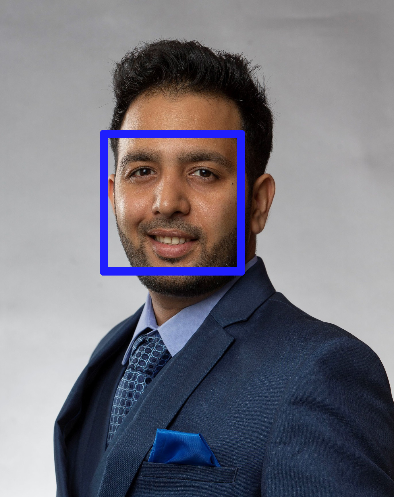

# CodeClinicChallenges
This project is to solve the code clinic challenges with C# as instructed by Anton Delsink in LinkedIn Learning 

## Table of contents
* [General info](#general-info)
* [Screenshots](#screenshots)
* [Technologies](#technologies)
* [Setup](#setup)
* [Features](#features)
* [Status](#status)
* [Inspiration](#inspiration)
* [Contact](#contact)

## General info
Code Clinic is a series of Courses on Linkedin.com where instructors solve the same problems using different languages. After going through the course, I decided to make projects to accomplish those tasks with C#. It's not the most sophisticated bit of code as I've been playing around with it. For the best solutions, please check Anton Delsink's course - Code Clinic: C#

## Screenshots

## Technologies
Visual Studio - C#

APIs:
Azure Cognitive Services FACE API - https://docs.microsoft.com/en-us/azure/cognitive-services/face/overview

Libraries:
Newtonsoft.Json
SixLabors.ImageSharp

## Setup
Once you open the solution file in Visual Studio, Please update the packages with Nuget Package Manager

Face Detection App:
  In Visual Studio, Right click the project --> Properties --> Debug --> Application arguments:
    <apiKey> <image location>
  *Add the Api Key and Image Location separated by a space (The project takes 2 arguments)

## Code Examples
//Count Number of faces in the image
            if(faceCount == 1)
            {
                Console.WriteLine("We found 1 face in the image");
            }
            else
            {
                Console.WriteLine($"We found {faceCount} faces in the image");
            }
//Create new folder if folder doesn't exist and save image.
            if (!Directory.Exists($"{Environment.CurrentDirectory}\\images"))
                Directory.CreateDirectory($"{Environment.CurrentDirectory}\\images");
            imageCopyName = $"{Environment.CurrentDirectory}\\images\\FaceDetectedImage.jpeg";

## Features
* Face Detection Application uses FACE API to detect faces in an image, places rectangles around the faces and counts the number of faces.

## Status
Project is: _in progress_
  Will continue adding a few more projects to the main solution as I get done with them

## Inspiration
Loved the course by Anton Delsink and wished to implement what I've learnt. Excited to be on the journey to learn more programming. 

## Contact
Created by [@ankurb86](https://www.linkedin.com/in/ankurb86/) - Feel free to contact me!
